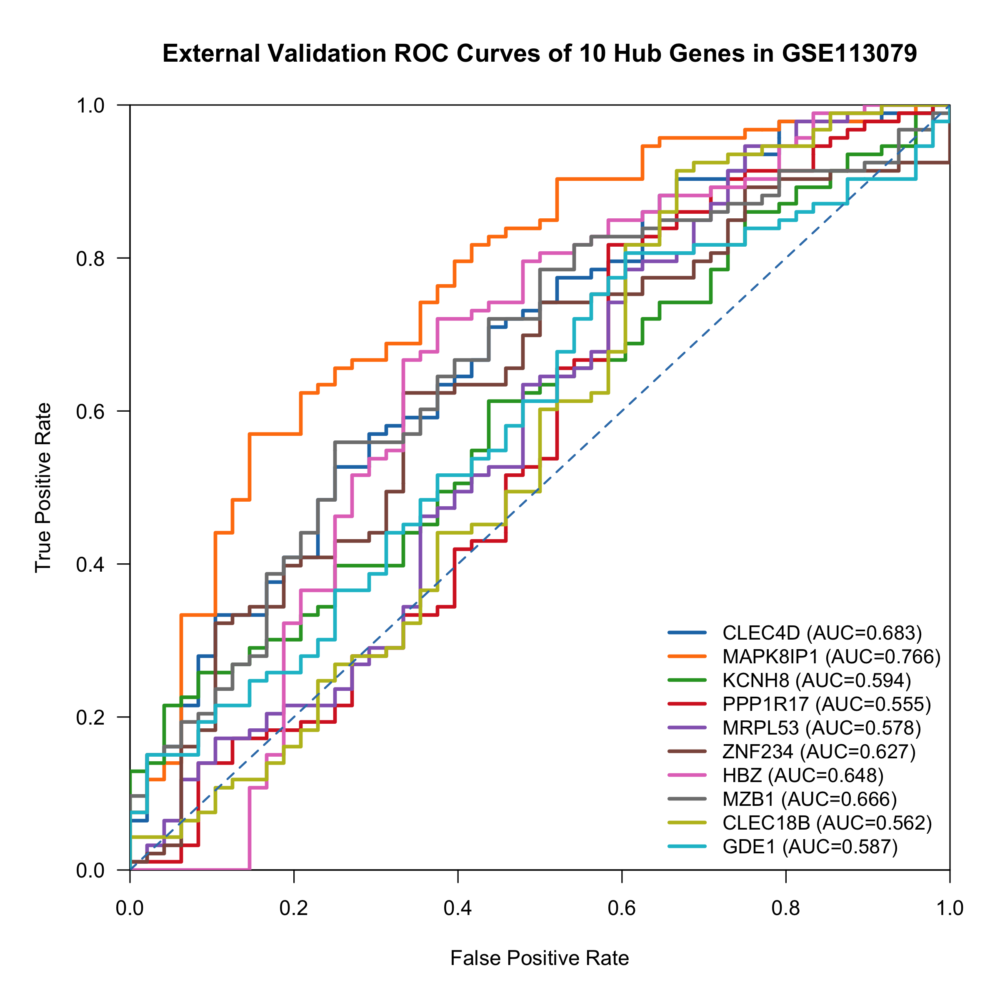

# 冠心病基因表达分析

[English](README.md)

本仓库收录一个冠心病（CAD）基因表达个人独立研究项目的 R 脚本和分析结果。项目合并两个发现队列，筛选候选基因，并在另一个数据集中进行评估。

## 数据与方法

| 数据集 | 用途 | CAD | 对照 |
|---|---|---:|---:|
| GSE20680 | 发现队列 | 87 | 52 |
| GSE20681 | 发现队列 | 99 | 99 |
| GSE113079 | 外部评估 | 93 | 48 |

以上为项目实际纳入样本。发现队列共 337 个样本、19,261 个基因，外部探针注释使用 GPL20115。

分析包括表达标准化、ComBat 批次校正、PCA、limma 差异分析，以及 LASSO、随机森林和 SVM-RFE 候选基因筛选。GO、KEGG 部分读取已有结果表进行解读和绘图。外部评估包括探针映射和 ROC 分析。

## 部分结果

已保存的三份筛选名单共有 10 个交集基因。在 GSE113079 中，MAPK8IP1 单基因 AUC 为 0.766；历史 10 基因加权评分 AUC 为 0.539。这些结果属于探索性分析，组合评分的区分能力有限。



[结果与图表说明](results/README.md) · [方法与局限](docs/METHODS.md)（英文）

## 开始使用

安装 R 后，在仓库根目录运行：

```sh
Rscript scripts/check_results.R
```

这一步仅使用基础 R 和仓库已有文件，检查基因名单交集并输出已保存的 AUC，不会重新训练模型或计算 ROC。

完整重跑还需要原项目的原始与中间输入文件，以及相关 R 包。数据未随仓库分发，详见 [数据说明](data/README.md) 和 [运行说明](docs/RUNNING.md)（英文）。

## 文件

```text
code/       分析脚本
scripts/    已附结果检查入口
results/    数值结果和基因名单
figures/    原分析的部分图表
data/       输入要求与文件校验清单
docs/       方法与运行说明
```

## 作者

孙嘉良（Jialiang Sun）。作为个人独立项目完成数据整理、分析、结果解释和报告撰写。

仓库发布后，如有分析相关问题，可通过 Issues 提出。目前未选择软件许可证；第三方数据和依赖遵循各自条款。
